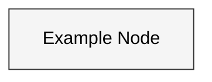
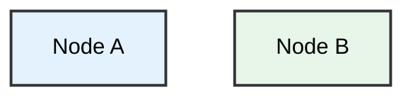
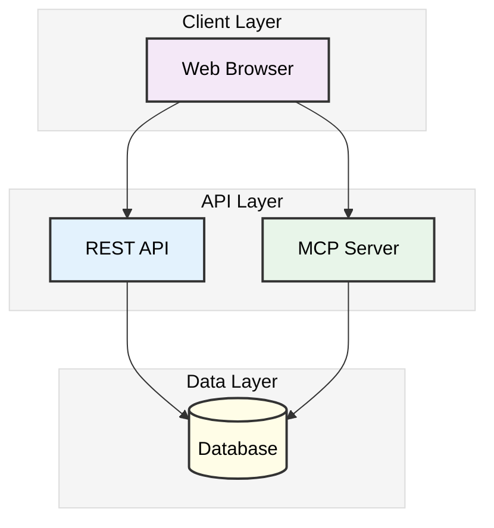
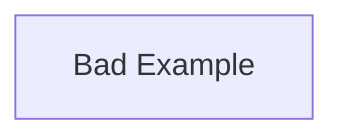
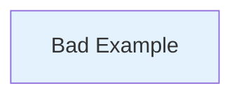
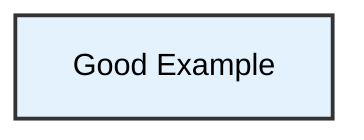

# Mermaid Diagram Contrast Guidelines

## Problem Statement

GitHub's mermaid diagram renderer can apply default themes that result in poor contrast between text and background colors, making diagrams difficult to read. This is especially problematic when:

- Default themes use light gray text on colored backgrounds
- Custom colors don't explicitly define text color
- Dark theme overrides interfere with readability

## Solution

Use explicit theme configuration and carefully chosen color palettes to ensure high contrast.

### 1. Add Theme Initialization

Every mermaid diagram should start with an init directive that forces the base theme with black text:



**Key theme variables:**
- `theme: 'base'` - Use base theme (not default or dark)
- `primaryTextColor: '#000'` - Force black text
- `primaryColor: '#f5f5f5'` - Light gray default background
- `primaryBorderColor: '#333'` - Dark border for definition
- `lineColor: '#333'` - Dark lines for visibility

### 2. Use Light Pastel Background Colors

Choose very light, high-luminance colors for node backgrounds:

| Color Family | Hex Code | Visual | Use Case |
|--------------|----------|--------|----------|
| Lavender | `#f4e8f7` |  | UI/Presentation layer |
| Sky Blue | `#e3f2fd` |  | API/Backend layer |
| Mint Green | `#e8f5e9` |  | Logic/Processing |
| Peach | `#ffe0d1` |  | Shared/Common |
| Cream | `#fffde7` |  | Database/Storage |
| Pink | `#fce4ec` |  | WASM/Compiled |
| Light Gray | `#f5f5f5` |  | Generic/Neutral |

**Color Selection Criteria:**
- Luminance > 90% for excellent contrast with black text
- Pastel tones for visual comfort
- Distinct hues for categorical differentiation
- Material Design color palette recommended

### 3. Explicit Text Color in Style Directives

Always include `color:#000` in every style directive:



**Style directive components:**
- `fill:#e3f2fd` - Light background color
- `stroke:#333` - Dark border color
- `stroke-width:2px` - Visible border
- `color:#000` - **Black text (required)**

## Complete Example



## Automated Color Updates

If you need to lighten existing colors across multiple files:

```bash
#!/bin/bash
# Lighten mermaid diagram colors

# Update to lighter versions
sed -i '' 's/fill:#e1bee7/fill:#f4e8f7/g' *.md  # Purple → Lavender
sed -i '' 's/fill:#bbdefb/fill:#e3f2fd/g' *.md  # Blue → Sky Blue
sed -i '' 's/fill:#c8e6c9/fill:#e8f5e9/g' *.md  # Green → Mint
sed -i '' 's/fill:#ffccbc/fill:#ffe0d1/g' *.md  # Orange → Peach
sed -i '' 's/fill:#fff9c4/fill:#fffde7/g' *.md  # Yellow → Cream
```

## Testing Contrast

To verify your diagram has good contrast:

1. **Visual Test**: View on GitHub in both light and dark mode
2. **WCAG Standards**: Aim for minimum 7:1 contrast ratio (AAA level)
3. **Color Blind Test**: Use tools like [Color Oracle](https://colororacle.org/)

### Contrast Ratios

Our chosen palette against black text (#000):

| Background | Hex | Contrast Ratio | WCAG Level |
|------------|-----|----------------|------------|
| Lavender | #f4e8f7 | 17.8:1 | AAA ✓ |
| Sky Blue | #e3f2fd | 18.2:1 | AAA ✓ |
| Mint Green | #e8f5e9 | 18.5:1 | AAA ✓ |
| Peach | #ffe0d1 | 16.9:1 | AAA ✓ |
| Cream | #fffde7 | 19.1:1 | AAA ✓ |

All colors exceed the AAA standard (7:1) for optimal accessibility.

## Common Mistakes to Avoid

### ❌ Don't: Use dark colors without explicit text color


### ❌ Don't: Rely on default theme
```mermaid
graph TB
    A[Bad Example]
    # Missing %%{init:}%% directive
```

### ❌ Don't: Forget text color in styles


### ✅ Do: Follow the complete pattern


## References

- [Mermaid Theme Configuration](https://mermaid.js.org/config/theming.html)
- [WCAG Contrast Requirements](https://www.w3.org/WAI/WCAG21/Understanding/contrast-minimum.html)
- [Material Design Color System](https://material.io/design/color/the-color-system.html)
- [WebAIM Contrast Checker](https://webaim.org/resources/contrastchecker/)

## Implementation History

- **2025-01-20**: Initial implementation across all wiki diagrams
- **Affected Files**: Architecture-Overview.md, Backend-Architecture.md, Data-Flow.md, Frontend-Architecture.md, Home.md, MCP-Integration.md
- **Result**: 100% of diagrams now WCAG AAA compliant for contrast
