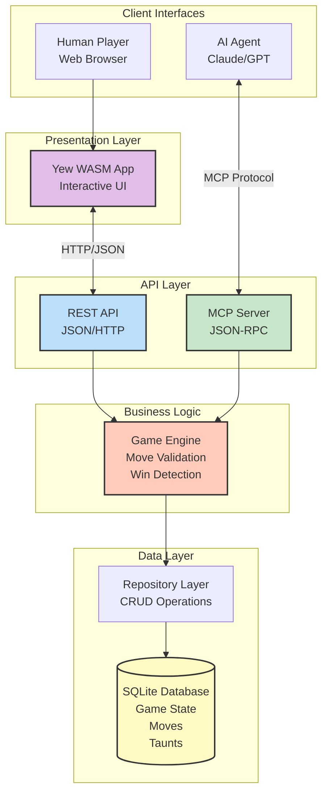
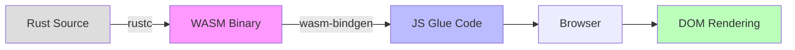
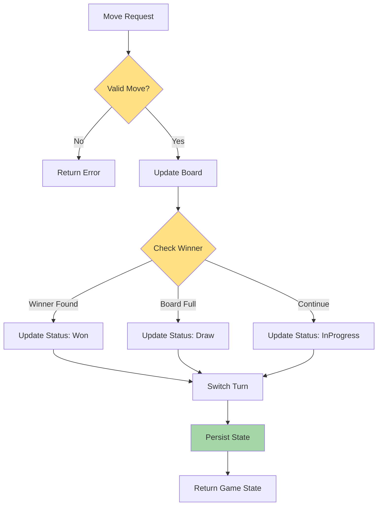
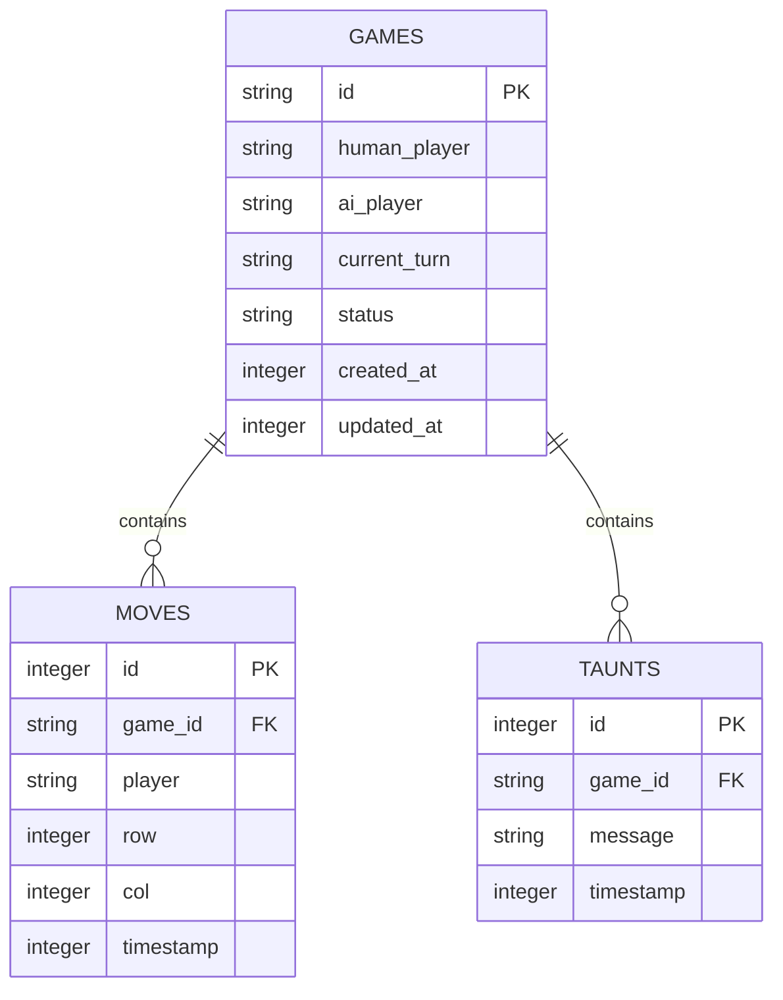
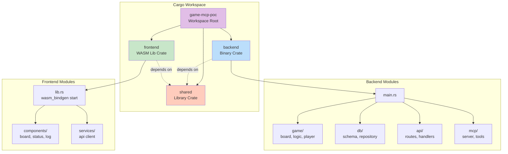
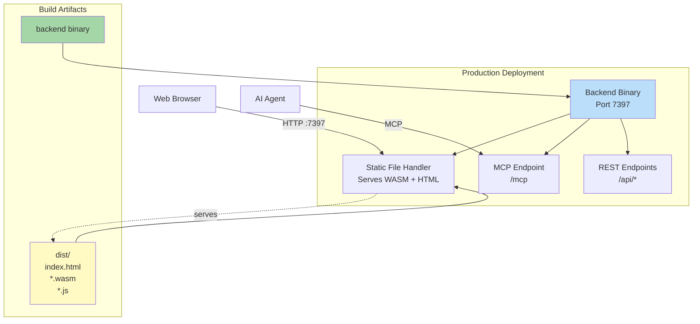

# Architecture Overview

This document provides a comprehensive overview of the system architecture for the Tic-Tac-Toe MCP proof-of-concept.

## System Design Philosophy

The architecture follows these core principles:

1. **Separation of Concerns** - Clear boundaries between UI, API, game logic, and persistence
2. **Type Safety** - Leveraging Rust's type system for compile-time guarantees
3. **Dual Interface** - Supporting both human (web) and AI (MCP) interactions
4. **Testability** - TDD-friendly design with mockable interfaces
5. **Clean Code** - Enforced via rustfmt and clippy with no disabled checks

## High-Level Architecture



## Component Layers

### 1. Client Interfaces

**Human Players** interact via modern web browsers supporting WebAssembly. The interface provides:
- Point-and-click gameplay
- Visual feedback and animations
- Real-time status updates
- Game event logging

**AI Agents** connect via the Model Context Protocol (MCP), enabling:
- Programmatic game state inspection
- Structured move commands
- Strategic decision-making
- Message-based player interaction

### 2. Presentation Layer (Frontend)

The frontend is built with **Yew** (Rust's React-like framework) and compiled to **WebAssembly**:



**Key Characteristics:**
- Reactive state management
- Type-safe props and events
- CSS-in-Rust styling
- Browser console logging

### 3. API Layer (Backend Interfaces)

#### REST API

Standard HTTP/JSON endpoints for the web UI:

| Endpoint | Method | Purpose |
|----------|--------|---------|
| `/api/game/state` | GET | Fetch current game state |
| `/api/game/move` | POST | Submit a move |
| `/api/game/restart` | POST | Start new game |
| `/api/game/history` | GET | Retrieve move log |
| `/api/taunts` | GET | Get taunt messages |

#### MCP Server

JSON-RPC interface providing structured tools:

| Tool | Purpose |
|------|---------|
| `view_game_state` | Inspect board state |
| `get_turn` | Determine current player |
| `make_move` | Execute move |
| `taunt_player` | Send message |
| `restart_game` | Reset game |
| `get_game_history` | View past moves |

### 4. Business Logic Layer

Core game engine implementing:



**Responsibilities:**
- Move validation (bounds, occupancy)
- Win condition detection (rows, columns, diagonals)
- Draw detection (full board, no winner)
- Turn management
- State transitions

### 5. Data Layer

#### Repository Pattern

Abstracts database operations:

```rust
pub trait GameRepository {
    fn create_game(&self) -> Result<GameState>;
    fn get_game(&self, id: &str) -> Result<GameState>;
    fn update_game(&self, state: &GameState) -> Result<()>;
    fn add_move(&self, game_id: &str, mov: &Move) -> Result<()>;
    fn add_taunt(&self, game_id: &str, message: &str) -> Result<()>;
}
```

#### Database Schema



**Storage Strategy:**
- SQLite file-based database
- WAL mode for concurrent access
- Indexed queries for performance
- Timestamps for ordering and history

## Technology Stack Detail

| Component | Technology | Justification |
|-----------|------------|---------------|
| **Language** | Rust 2024 Edition | Memory safety, type safety, performance |
| **Frontend Framework** | Yew | React-like patterns, WASM-native |
| **Backend Framework** | Axum | Async, ergonomic, Tower middleware |
| **Database** | SQLite + rusqlite | Embedded, reliable, simple deployment |
| **Protocol** | MCP (Model Context Protocol) | AI agent integration standard |
| **Testing** | cargo test + wasm-bindgen-test | Native Rust testing, WASM support |
| **Logging** | tracing + console_log | Structured logs, multi-target output |
| **Build Tools** | trunk + wasm-bindgen-cli | WASM bundling, JS interop |

## Workspace Structure



## Shared Type System

The `shared` crate defines common types used across frontend and backend:

```rust
// Core game types (simplified)
pub enum Player { X, O }
pub enum Cell { Empty, Occupied(Player) }
pub struct Board { cells: [[Cell; 3]; 3] }
pub enum GameStatus { InProgress, Won(Player), Draw }

// Transfer objects
pub struct GameState {
    id: String,
    board: Board,
    current_turn: Player,
    human_player: Player,
    ai_player: Player,
    status: GameStatus,
    move_history: Vec<Move>,
    taunts: Vec<String>,
}

pub struct Move {
    player: Player,
    row: u8,
    col: u8,
    timestamp: i64,
}
```

**Benefits:**
- Compile-time type checking across boundaries
- Automatic serialization/deserialization (serde)
- No type mismatches between client and server
- Shared validation logic

## Deployment Architecture



**Deployment Steps:**
1. Build backend: `cargo build --release --package backend`
2. Build frontend: `trunk build --release` (in `frontend/`)
3. Backend serves both API and static files from single process
4. No separate web server needed

## Next Steps

Explore detailed documentation for each layer:

- [[Backend Architecture]] - Deep dive into server components
- [[Frontend Architecture]] - Yew and WASM implementation details
- [[MCP Integration]] - AI agent protocol and tools
- [[Data Flow]] - Request/response sequence diagrams

Return to [[Home]] for the main wiki page.
