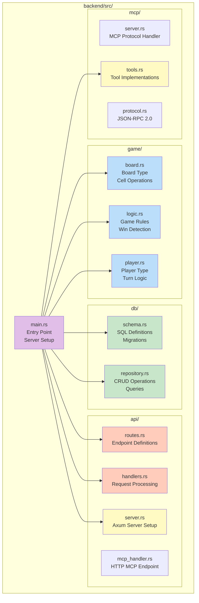
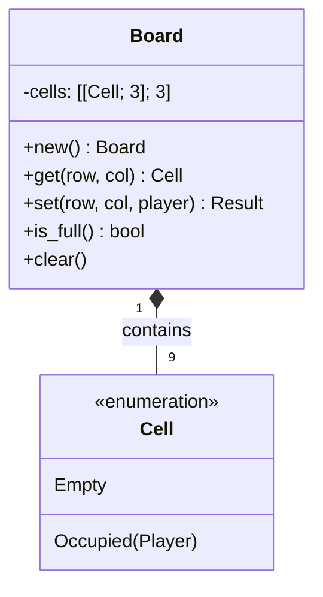
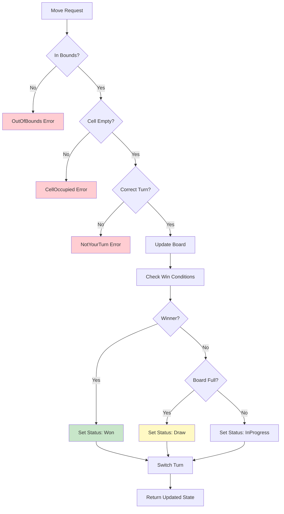
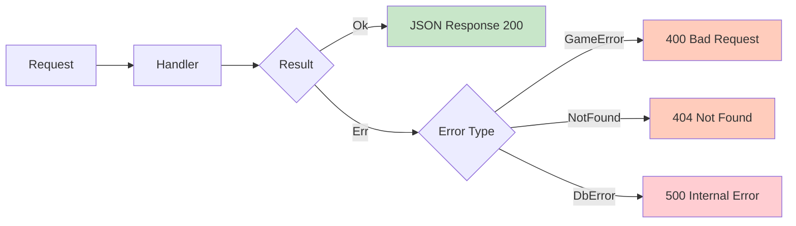
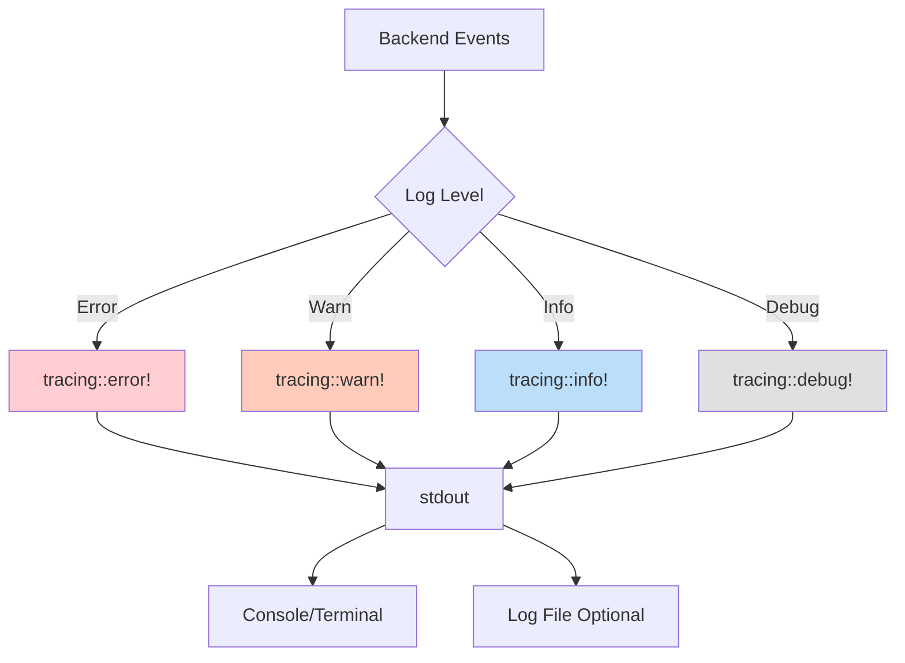

# Backend Architecture

The backend is a Rust-based server that provides four key functions:
1. REST API for web UI communication
2. MCP HTTP endpoint for AI agent integration
3. Server-Sent Events (SSE) for real-time updates
4. Static file serving for the WASM frontend

The system supports **dual MCP transports**: HTTP (port 7397) and stdio (binary for Claude Desktop).

## Module Structure



## Core Components

### 1. Main Application (`main.rs`)

The entry point that wires all components together:

```rust
#[tokio::main]
async fn main() {
    // Initialize logging
    tracing_subscriber::fmt::init();

    // Setup database
    let db_path = env::var("DB_PATH").unwrap_or_else(|_| "game.db".to_string());
    let repo = Arc::new(SqliteRepository::new(&db_path)?);

    // Initialize game state
    repo.init_schema()?;

    // Create SSE broadcaster
    let (sse_tx, _) = broadcast::channel(100);

    // Build Axum router
    let app = Router::new()
        .route("/api/game/state", get(handlers::get_game_state))
        .route("/api/game/move", post(handlers::make_move))
        .route("/api/game/restart", post(handlers::restart_game))
        .route("/api/game/history", get(handlers::get_history))
        .route("/api/taunts", post(handlers::send_taunt))
        .route("/sse", get(handlers::sse_handler))
        .route("/mcp", post(mcp_handler::handle_mcp_request))
        .nest_service("/", ServeDir::new("frontend/dist"))
        .layer(Extension(repo.clone()))
        .layer(Extension(sse_tx));

    // Start HTTP server (serves REST + MCP + SSE + static files)
    let addr = SocketAddr::from(([127, 0, 0, 1], 3000));
    axum::Server::bind(&addr)
        .serve(app.into_make_service())
        .await?;
}
```

**Responsibilities:**
- Configure tracing/logging
- Initialize database connection pool
- Create SSE broadcast channel
- Set up HTTP routes (REST + MCP + SSE)
- Serve static WASM files
- Handle graceful shutdown

**Key Updates:**
- Single HTTP server on port 7397 handles all traffic
- SSE for real-time updates to frontend
- MCP HTTP endpoint at `/mcp` for AI agents
- Separate stdio MCP binary for Claude Desktop

### 2. Game Logic Module

#### `board.rs` - Board State Management



**Key Operations:**
- Board initialization (empty 3x3 grid)
- Cell access with bounds checking
- Cell modification with validation
- Full board detection
- Board serialization/deserialization

#### `logic.rs` - Game Rules Engine



**Core Functions:**

```rust
/// Validate and execute a move
pub fn make_move(
    state: &mut GameState,
    player: Player,
    row: u8,
    col: u8,
) -> Result<(), GameError> {
    // Validate bounds
    if row >= 3 || col >= 3 {
        return Err(GameError::OutOfBounds);
    }

    // Check correct turn
    if state.current_turn != player {
        return Err(GameError::NotYourTurn);
    }

    // Check cell availability
    if state.board.get(row, col)? != Cell::Empty {
        return Err(GameError::CellOccupied);
    }

    // Execute move
    state.board.set(row, col, player)?;
    state.move_history.push(Move { player, row, col, timestamp });

    // Check game outcome
    if let Some(winner) = check_winner(&state.board) {
        state.status = GameStatus::Won(winner);
    } else if state.board.is_full() {
        state.status = GameStatus::Draw;
    }

    // Switch turn
    state.current_turn = state.current_turn.opponent();

    Ok(())
}

/// Check all win conditions
pub fn check_winner(board: &Board) -> Option<Player> {
    // Check rows
    for row in 0..3 {
        if let Some(p) = check_line(board, [(row,0), (row,1), (row,2)]) {
            return Some(p);
        }
    }

    // Check columns
    for col in 0..3 {
        if let Some(p) = check_line(board, [(0,col), (1,col), (2,col)]) {
            return Some(p);
        }
    }

    // Check diagonals
    if let Some(p) = check_line(board, [(0,0), (1,1), (2,2)]) {
        return Some(p);
    }
    if let Some(p) = check_line(board, [(0,2), (1,1), (2,0)]) {
        return Some(p);
    }

    None
}
```

#### `player.rs` - Player Type

Simple enum with helper methods:

```rust
#[derive(Debug, Clone, Copy, PartialEq, Eq, Serialize, Deserialize)]
pub enum Player {
    X,
    O,
}

impl Player {
    pub fn opponent(self) -> Self {
        match self {
            Player::X => Player::O,
            Player::O => Player::X,
        }
    }

    pub fn random() -> Self {
        if rand::random() {
            Player::X
        } else {
            Player::O
        }
    }
}
```

### 3. Database Module

#### `schema.rs` - Database Schema

SQL definitions for tables:

```sql
-- Game state table
CREATE TABLE IF NOT EXISTS games (
    id TEXT PRIMARY KEY,
    human_player TEXT NOT NULL,  -- 'X' or 'O'
    ai_player TEXT NOT NULL,     -- 'X' or 'O'
    current_turn TEXT NOT NULL,  -- 'X' or 'O'
    status TEXT NOT NULL,        -- 'InProgress', 'Won_X', 'Won_O', 'Draw'
    created_at INTEGER NOT NULL,
    updated_at INTEGER NOT NULL
);

-- Move history table
CREATE TABLE IF NOT EXISTS moves (
    id INTEGER PRIMARY KEY AUTOINCREMENT,
    game_id TEXT NOT NULL,
    player TEXT NOT NULL,
    row INTEGER NOT NULL,
    col INTEGER NOT NULL,
    timestamp INTEGER NOT NULL,
    FOREIGN KEY (game_id) REFERENCES games(id)
);

-- Taunt messages table
CREATE TABLE IF NOT EXISTS taunts (
    id INTEGER PRIMARY KEY AUTOINCREMENT,
    game_id TEXT NOT NULL,
    message TEXT NOT NULL,
    timestamp INTEGER NOT NULL,
    FOREIGN KEY (game_id) REFERENCES games(id)
);

-- Indexes for performance
CREATE INDEX IF NOT EXISTS idx_moves_game_id ON moves(game_id);
CREATE INDEX IF NOT EXISTS idx_taunts_game_id ON taunts(game_id);
```

#### `repository.rs` - Data Access Layer

Repository trait for testability:

```rust
pub trait GameRepository: Send + Sync {
    fn create_game(&self) -> Result<GameState>;
    fn get_game(&self, id: &str) -> Result<Option<GameState>>;
    fn update_game(&self, state: &GameState) -> Result<()>;
    fn add_move(&self, game_id: &str, mov: &Move) -> Result<()>;
    fn get_moves(&self, game_id: &str) -> Result<Vec<Move>>;
    fn add_taunt(&self, game_id: &str, message: &str) -> Result<()>;
    fn get_taunts(&self, game_id: &str) -> Result<Vec<Taunt>>;
}

pub struct SqliteRepository {
    pool: Arc<Mutex<Connection>>,
}

impl SqliteRepository {
    pub fn new(db_path: &str) -> Result<Self> {
        let conn = Connection::open(db_path)?;
        conn.execute_batch("PRAGMA journal_mode=WAL;")?;
        Ok(Self {
            pool: Arc::new(Mutex::new(conn)),
        })
    }

    pub fn init_schema(&self) -> Result<()> {
        // Execute schema creation SQL
    }
}
```

**Design Pattern Benefits:**
- Trait allows mock implementations for testing
- Connection pooling for concurrent access
- WAL mode for better concurrency
- Prepared statements for SQL injection prevention

### 4. API Module

#### `routes.rs` - HTTP Endpoints

```rust
pub fn routes() -> Router {
    Router::new()
        .route("/api/game/state", get(handlers::get_game_state))
        .route("/api/game/move", post(handlers::make_move))
        .route("/api/game/restart", post(handlers::restart_game))
        .route("/api/game/history", get(handlers::get_history))
        .route("/api/taunts", get(handlers::get_taunts))
}
```

#### `handlers.rs` - Request Handlers

```rust
pub async fn make_move(
    Extension(repo): Extension<Arc<dyn GameRepository>>,
    Json(move_req): Json<MoveRequest>,
) -> Result<Json<GameState>, ApiError> {
    // Get current game
    let mut state = repo.get_game("current")?.ok_or(ApiError::GameNotFound)?;

    // Validate and execute move
    logic::make_move(&mut state, Player::X, move_req.row, move_req.col)?;

    // Persist updated state
    repo.update_game(&state)?;
    repo.add_move("current", &state.move_history.last().unwrap())?;

    // Log the move
    tracing::info!("Move made: row={}, col={}, player={:?}", move_req.row, move_req.col, Player::X);

    Ok(Json(state))
}
```

**Error Handling:**



### 5. MCP Module

#### `server.rs` - MCP Protocol Handler (Stdio)

Implements JSON-RPC protocol for stdio transport (used by Claude Desktop):

```rust
pub struct McpServer {
    manager: GameManager,
}

impl McpServer {
    pub fn new(db_path: &str) -> Result<Self> {
        let manager = GameManager::new(db_path)?;
        Ok(Self { manager })
    }

    /// Run stdio server loop
    pub fn run(&mut self) -> io::Result<()> {
        let stdin = io::stdin();
        let mut stdout = io::stdout();

        for line in stdin.lock().lines() {
            let line = line?;
            let response = self.handle_request(&line);
            writeln!(stdout, "{}", response)?;
            stdout.flush()?;
        }
        Ok(())
    }

    fn handle_request(&mut self, json: &str) -> String {
        // Parse JSON-RPC request
        // Dispatch to appropriate tool
        // Return JSON-RPC response
    }
}
```

#### `mcp_handler.rs` - HTTP MCP Endpoint

Handles HTTP POST requests to `/mcp`:

```rust
pub async fn handle_mcp_request(
    Extension(manager): Extension<Arc<Mutex<GameManager>>>,
    Extension(sse_tx): Extension<broadcast::Sender<SseEvent>>,
    Json(request): Json<JsonRpcRequest>,
) -> Json<JsonRpcResponse> {
    // Broadcast MCP activity start
    let _ = sse_tx.send(SseEvent::McpActivityStart);

    // Dispatch to MCP tools
    let response = dispatch_mcp_request(manager, request).await;

    // Broadcast MCP activity end
    let _ = sse_tx.send(SseEvent::McpActivityEnd);

    Json(response)
}
```

#### `tools.rs` - MCP Tool Implementations

See [[MCP Integration]] for detailed tool documentation.

## Logging Strategy



**Logged Events:**
- HTTP requests (method, path, status, duration)
- Game moves (player, position, outcome)
- MCP tool calls (tool name, parameters)
- Database operations (queries, errors)
- Server lifecycle (startup, shutdown)

## Configuration

Environment variables:

| Variable | Default | Description |
|----------|---------|-------------|
| `GAME_DB_PATH` | `game.db` | SQLite database file path |
| `PORT` | `7397` | HTTP server port (REST + MCP + SSE) |
| `RUST_LOG` | `info` | Log level (error/warn/info/debug/trace) |

**Dual MCP Transport:**
- **HTTP**: `POST /mcp` on port 7397 (for OpenAI, Gemini, HTTP agents)
- **Stdio**: `./target/release/game-mcp-server` binary (for Claude Desktop)

## Testing Strategy

```rust
#[cfg(test)]
mod tests {
    use super::*;

    // Unit tests for game logic
    #[test]
    fn test_win_detection_row() {
        let mut board = Board::new();
        board.set(0, 0, Player::X);
        board.set(0, 1, Player::X);
        board.set(0, 2, Player::X);
        assert_eq!(check_winner(&board), Some(Player::X));
    }

    // Integration tests with mock repository
    #[tokio::test]
    async fn test_make_move_api() {
        let repo = Arc::new(MockRepository::new());
        let app = routes().layer(Extension(repo));

        let response = app
            .oneshot(
                Request::post("/api/game/move")
                    .json(&MoveRequest { row: 0, col: 0 })
                    .unwrap()
            )
            .await
            .unwrap();

        assert_eq!(response.status(), StatusCode::OK);
    }
}
```

## Related Pages

- [[Architecture Overview]] - System-wide architecture
- [[MCP Integration]] - MCP protocol details
- [[Data Flow]] - Request/response sequences
- [[Home]] - Return to wiki home

## Further Reading

- [Detailed Design Specification](https://github.com/sw-game-dev/game-mcp-poc/blob/main/docs/design.md)
- [Backend Source Code](https://github.com/sw-game-dev/game-mcp-poc/tree/main/backend/src)
