# Data Flow

This page documents the various data flows and interaction patterns in the tic-tac-toe system, showing how data moves between components in different scenarios.

## Overview

The system supports two primary interaction modes:

1. **Human Player** via web UI (REST API)
2. **AI Agent** via MCP protocol

Both interact with the same underlying game state, enabling hybrid human-AI gameplay.

## System Data Flow


## Human Player Flows

### 1. Initial Page Load


### 2. Making a Move


### 3. Real-time Game State Updates (SSE)

The UI receives real-time state changes via Server-Sent Events (e.g., when AI makes a move):


**Implementation**: The frontend establishes a persistent SSE connection on component mount. All game state changes (moves, taunts, restarts) are broadcast immediately to all connected clients. No polling is required.

### 4. Receiving Taunts (via SSE)

```mermaid
sequenceDiagram
    participant UI
    participant Backend
    participant DB
    participant Agent

    Note over UI,Backend: SSE Connection Established

    Agent->>Backend: POST /api/game/taunt {message}
    Backend->>DB: INSERT INTO taunts
    DB->>Backend: Success
    Backend->>Backend: Broadcast via SSE
    Backend-->>UI: SSE event: GameState (includes taunts)
    UI->>UI: Detect new taunt
    UI->>UI: Display in "Trash Talk" panel
    UI->>UI: Log to Event Log
    Note over UI: 💬 MCP: "Nice try, human!"
```



**Note**: Taunts are delivered in real-time via Server-Sent Events (SSE), not polling. The frontend maintains an SSE connection to `/api/events` which receives complete game state updates whenever any change occurs (moves, taunts, game restarts).

### 5. Restarting Game


## AI Agent Flows

### 1. Connecting to MCP Server


### 2. Making Strategic Move


### 3. Game History Analysis


## Hybrid Interaction Flow

Human and AI playing together:


## State Synchronization


## Data Models

### GameState Transfer Object

```rust
#[derive(Debug, Clone, Serialize, Deserialize)]
pub struct GameState {
    pub id: String,
    pub board: Board,
    pub current_turn: Player,
    pub human_player: Player,
    pub ai_player: Player,
    pub status: GameStatus,
    pub move_history: Vec<Move>,
    pub taunts: Vec<String>,
}
```

**JSON Representation:**
```json
{
  "id": "current",
  "board": [
    ["X", "O", null],
    ["X", "O", null],
    [null, null, null]
  ],
  "currentTurn": "X",
  "humanPlayer": "X",
  "aiPlayer": "O",
  "status": "InProgress",
  "moveHistory": [
    {"player": "X", "row": 0, "col": 0, "timestamp": 1234567890},
    {"player": "O", "row": 0, "col": 1, "timestamp": 1234567895}
  ],
  "taunts": ["Center is mine!"]
}
```

### Move Object

```rust
#[derive(Debug, Clone, Serialize, Deserialize)]
pub struct Move {
    pub player: Player,
    pub row: u8,
    pub col: u8,
    pub timestamp: i64,
}
```

### Database Schema Flow


## Error Propagation


**Error Mapping Table:**

| GameError | HTTP Status | MCP Response | User Message |
|-----------|-------------|--------------|--------------|
| `OutOfBounds` | 400 Bad Request | `isError: true` | "Invalid position" |
| `CellOccupied` | 400 Bad Request | `isError: true` | "Cell already taken" |
| `NotYourTurn` | 400 Bad Request | `isError: true` | "Not your turn" |
| `GameNotFound` | 404 Not Found | `isError: true` | "No active game" |
| `DatabaseError` | 500 Internal Error | `isError: true` | "Server error" |

## Performance Considerations

### Caching Strategy


**Current Implementation:** No caching (simplicity)
**Future Optimization:** In-memory cache with TTL

### Database Connection Pooling


**SQLite WAL Mode Benefits:**
- Multiple concurrent readers
- Non-blocking reads during writes
- Better concurrency for our use case

## Logging Flow


**Log Levels:**
- **ERROR**: Critical failures
- **WARN**: Recoverable issues
- **INFO**: Important events (moves, wins)
- **DEBUG**: Detailed flow information
- **TRACE**: Verbose debugging

## Related Pages

- [[Architecture Overview]] - System architecture
- [[Backend Architecture]] - Server components
- [[Frontend Architecture]] - Client components
- [[MCP Integration]] - AI agent protocol
- [[Home]] - Return to wiki home

## Further Reading

- [Detailed Design Document](https://github.com/sw-game-dev/game-mcp-poc/blob/main/docs/design.md)
- [API Handlers Source](https://github.com/sw-game-dev/game-mcp-poc/tree/main/backend/src/api)
- [MCP Tools Source](https://github.com/sw-game-dev/game-mcp-poc/tree/main/backend/src/mcp)
