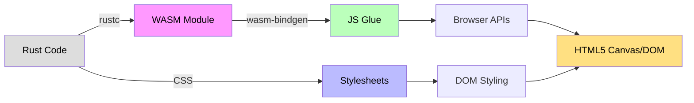
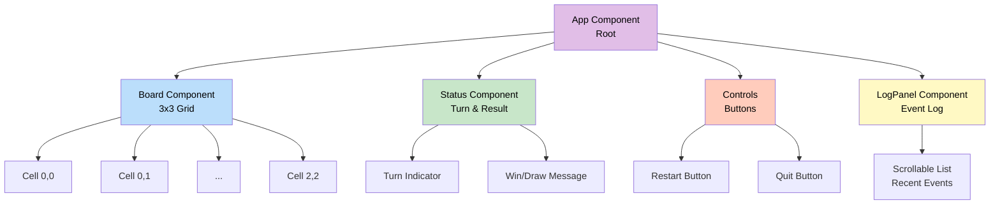
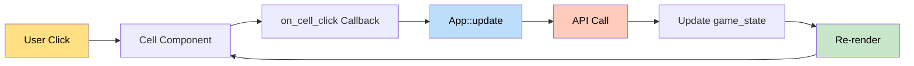
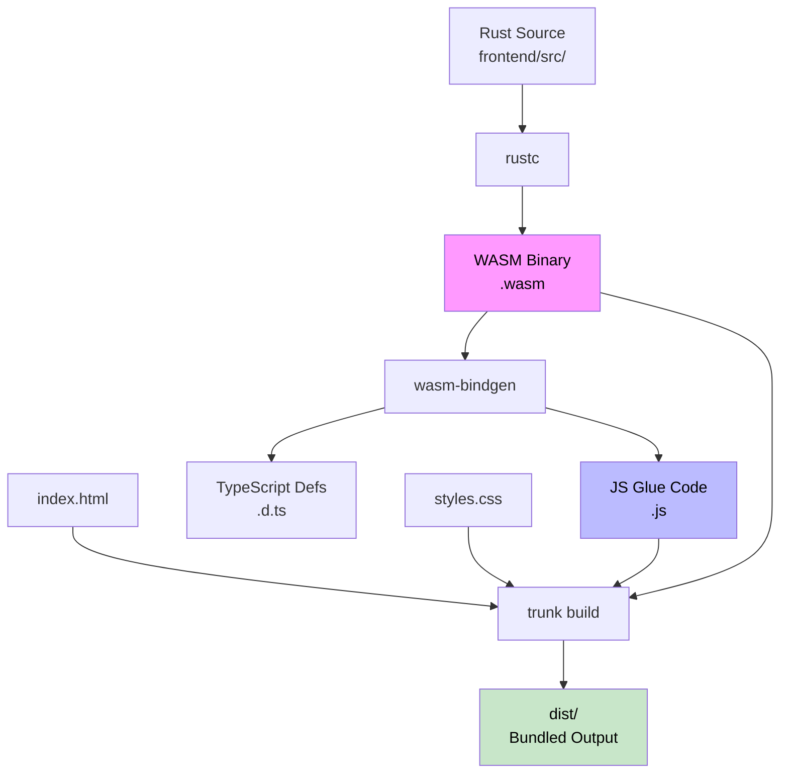
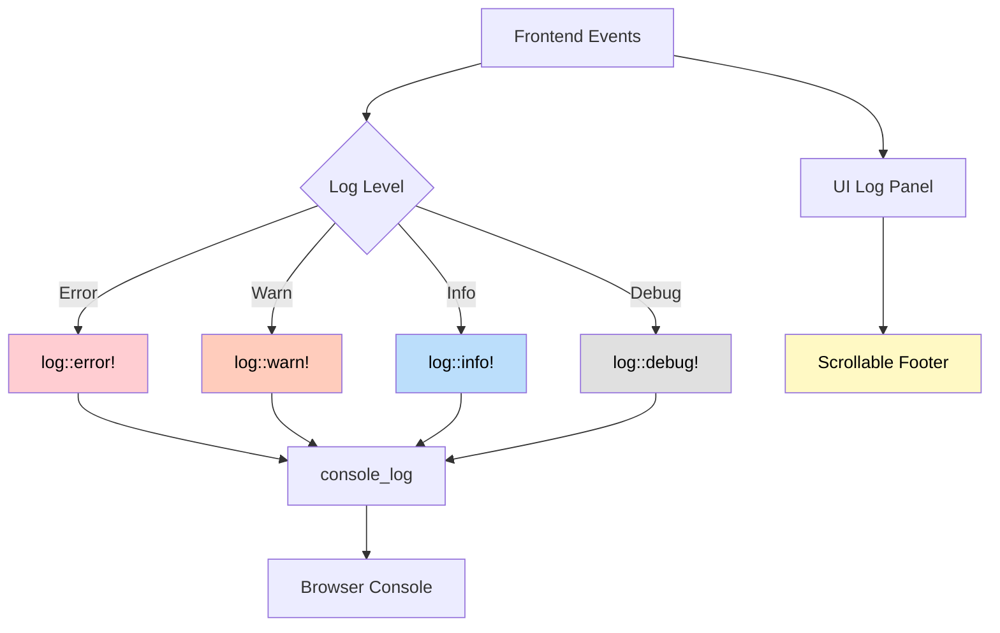

# Frontend Architecture

The frontend is a single-page application built with **Yew**, a modern Rust framework for creating WebAssembly-powered web apps. It provides an interactive tic-tac-toe interface with real-time updates and comprehensive logging.

## Technology Stack



| Component | Technology | Purpose |
|-----------|------------|---------|
| **Framework** | Yew 0.21+ | Reactive component-based UI |
| **Language** | Rust 2024 | Type-safe, memory-safe frontend code |
| **Target** | wasm32-unknown-unknown | WebAssembly compilation |
| **Bundler** | Trunk | WASM build tool and dev server |
| **Bindings** | wasm-bindgen | JS/WASM interop layer |
| **HTTP Client** | gloo-net | WASM-compatible HTTP requests |
| **Logging** | console_log | Browser console integration |
| **Styling** | CSS3 | Gradient backgrounds, grid layout |

## Project Structure

```
frontend/
├── Cargo.toml          # Library crate with cdylib
├── index.html          # HTML entry point
├── styles.css          # Application styles
└── src/
    ├── lib.rs          # Entry point with wasm_bindgen(start)
    ├── components/
    │   ├── mod.rs
    │   ├── board.rs    # Game board component
    │   ├── status.rs   # Status display component
    │   └── log_panel.rs # Log footer component
    └── services/
        ├── mod.rs
        └── api.rs      # REST API client
```

## WASM Entry Point

**Critical Design Detail:** The frontend uses `[lib]` crate type, NOT `[bin]`. The entry point MUST use the `#[wasm_bindgen(start)]` attribute:

```rust
use wasm_bindgen::prelude::*;
use yew::prelude::*;

#[wasm_bindgen(start)]
pub fn main() {
    // Initialize logging to browser console
    console_log::init_with_level(log::Level::Debug)
        .expect("Failed to initialize logger");

    log::info!("Starting Tic-Tac-Toe WASM app");

    // Mount Yew app to DOM
    yew::Renderer::<App>::new().render();
}
```

**Why `#[wasm_bindgen(start)]` is Required:**
- Without this attribute, the `main()` function won't be called when WASM loads
- Symptom: Only CSS gradient background appears, no UI renders
- The attribute tells wasm-bindgen to generate JS that calls this function on module load

## Component Architecture



### App Component (Root)

The main application component that orchestrates all child components:

```rust
pub struct App {
    game_state: Option<GameState>,
    logs: Vec<String>,
    api_client: ApiClient,
}

pub enum Msg {
    LoadState,
    StateLoaded(GameState),
    MakeMove(u8, u8),
    MoveCompleted(GameState),
    Restart,
    AddLog(String),
    Error(String),
}

impl Component for App {
    type Message = Msg;
    type Properties = ();

    fn create(ctx: &Context<Self>) -> Self {
        // Load initial state
        ctx.link().send_message(Msg::LoadState);

        Self {
            game_state: None,
            logs: Vec::new(),
            api_client: ApiClient::new(),
        }
    }

    fn update(&mut self, ctx: &Context<Self>, msg: Self::Message) -> bool {
        match msg {
            Msg::LoadState => {
                let link = ctx.link().clone();
                wasm_bindgen_futures::spawn_local(async move {
                    match api_client.get_state().await {
                        Ok(state) => link.send_message(Msg::StateLoaded(state)),
                        Err(e) => link.send_message(Msg::Error(e.to_string())),
                    }
                });
                false
            }
            Msg::StateLoaded(state) => {
                self.add_log(&format!("Game loaded: {:?}", state.status));
                self.game_state = Some(state);
                true
            }
            Msg::MakeMove(row, col) => {
                let link = ctx.link().clone();
                wasm_bindgen_futures::spawn_local(async move {
                    match api_client.make_move(row, col).await {
                        Ok(state) => link.send_message(Msg::MoveCompleted(state)),
                        Err(e) => link.send_message(Msg::Error(e.to_string())),
                    }
                });
                false
            }
            // ... other message handlers
        }
    }

    fn view(&self, ctx: &Context<Self>) -> Html {
        html! {
            <div class="app">
                <h1>{"Tic-Tac-Toe"}</h1>
                <Status game_state={self.game_state.clone()} />
                <Board
                    game_state={self.game_state.clone()}
                    on_cell_click={ctx.link().callback(|(r, c)| Msg::MakeMove(r, c))}
                />
                <Controls
                    on_restart={ctx.link().callback(|_| Msg::Restart)}
                />
                <LogPanel logs={self.logs.clone()} />
            </div>
        }
    }
}
```

### Board Component

Renders the 3x3 game grid:

```rust
#[derive(Properties, PartialEq)]
pub struct BoardProps {
    pub game_state: Option<GameState>,
    pub on_cell_click: Callback<(u8, u8)>,
}

#[function_component(Board)]
pub fn board(props: &BoardProps) -> Html {
    let Some(state) = &props.game_state else {
        return html! { <div class="board loading">{"Loading..."}</div> };
    };

    let cells = (0..3).flat_map(|row| {
        (0..3).map(move |col| {
            let cell = state.board.cells[row as usize][col as usize];
            let onclick = {
                let callback = props.on_cell_click.clone();
                Callback::from(move |_| callback.emit((row, col)))
            };

            let content = match cell {
                Cell::Empty => html! {},
                Cell::Occupied(Player::X) => html! { <span class="x">{"X"}</span> },
                Cell::Occupied(Player::O) => html! { <span class="o">{"O"}</span> },
            };

            html! {
                <div
                    class={classes!("cell", cell_class(cell))}
                    onclick={onclick}
                    disabled={!is_clickable(state, row, col)}
                >
                    {content}
                </div>
            }
        })
    });

    html! {
        <div class="board">
            { for cells }
        </div>
    }
}
```

**State Management:**


### Status Component

Displays current game status:

```rust
#[derive(Properties, PartialEq)]
pub struct StatusProps {
    pub game_state: Option<GameState>,
}

#[function_component(Status)]
pub fn status(props: &StatusProps) -> Html {
    let Some(state) = &props.game_state else {
        return html! { <div class="status">{"Loading game..."}</div> };
    };

    let status_text = match state.status {
        GameStatus::InProgress => {
            format!("Turn: {} ({:?})",
                if state.current_turn == state.human_player { "You" } else { "AI" },
                state.current_turn)
        }
        GameStatus::Won(player) => {
            if player == state.human_player {
                "You won!".to_string()
            } else {
                "AI won!".to_string()
            }
        }
        GameStatus::Draw => "It's a draw!".to_string(),
    };

    html! {
        <div class="status">
            <p class="turn">{status_text}</p>
            <p class="assignments">
                {format!("You: {:?} | AI: {:?}", state.human_player, state.ai_player)}
            </p>
        </div>
    }
}
```

### LogPanel Component

Scrollable event log:

```rust
#[derive(Properties, PartialEq)]
pub struct LogPanelProps {
    pub logs: Vec<String>,
}

#[function_component(LogPanel)]
pub fn log_panel(props: &LogPanelProps) -> Html {
    let log_items = props.logs.iter().rev().take(20).map(|log| {
        html! { <li>{log}</li> }
    });

    html! {
        <div class="log-container">
            <h3>{"Game Log"}</h3>
            <ul class="log-list">
                { for log_items }
            </ul>
        </div>
    }
}
```

## API Service Layer

Abstracts REST API calls:

```rust
use gloo_net::http::Request;

pub struct ApiClient {
    base_url: String,
}

impl ApiClient {
    pub fn new() -> Self {
        Self {
            base_url: "http://localhost:7397/api".to_string(),
        }
    }

    pub async fn get_state(&self) -> Result<GameState, ApiError> {
        let url = format!("{}/game/state", self.base_url);
        let response = Request::get(&url)
            .send()
            .await?;

        if !response.ok() {
            return Err(ApiError::HttpError(response.status()));
        }

        let state: GameState = response.json().await?;
        log::debug!("Fetched game state: {:?}", state);

        Ok(state)
    }

    pub async fn make_move(&self, row: u8, col: u8) -> Result<GameState, ApiError> {
        let url = format!("{}/game/move", self.base_url);
        let body = serde_json::json!({ "row": row, "col": col });

        let response = Request::post(&url)
            .json(&body)?
            .send()
            .await?;

        if !response.ok() {
            let error_text = response.text().await?;
            return Err(ApiError::GameError(error_text));
        }

        let state: GameState = response.json().await?;
        log::info!("Move completed: ({}, {})", row, col);

        Ok(state)
    }

    pub async fn restart_game(&self) -> Result<GameState, ApiError> {
        let url = format!("{}/game/restart", self.base_url);
        let response = Request::post(&url)
            .send()
            .await?;

        response.json().await.map_err(Into::into)
    }
}
```

## Styling

CSS Grid layout for the board:

```css
.board {
    display: grid;
    grid-template-columns: repeat(3, 100px);
    grid-template-rows: repeat(3, 100px);
    gap: 5px;
    margin: 20px auto;
    width: fit-content;
}

.cell {
    width: 100px;
    height: 100px;
    border: 2px solid #333;
    display: flex;
    align-items: center;
    justify-content: center;
    font-size: 48px;
    font-weight: bold;
    cursor: pointer;
    background: white;
    transition: background 0.2s;
}

.cell:hover:not([disabled]) {
    background: #f0f0f0;
}

.cell[disabled] {
    cursor: not-allowed;
    opacity: 0.6;
}

.x {
    color: #e74c3c;
}

.o {
    color: #3498db;
}

.log-container {
    max-height: 200px;
    overflow-y: auto;
    border: 1px solid #ddd;
    padding: 10px;
    margin-top: 20px;
    background: #f9f9f9;
}
```

## Build Process



**Build Commands:**

```bash
# Development with hot-reload
cd frontend
trunk serve --open

# Production build
trunk build --release

# Output structure
dist/
├── index.html           # Entry HTML
├── frontend-*.wasm      # WASM binary
├── frontend-*.js        # JS glue code
└── styles.css           # Stylesheets
```

## WASM Testing

```rust
#[cfg(test)]
mod tests {
    use super::*;
    use wasm_bindgen_test::*;

    wasm_bindgen_test_configure!(run_in_browser);

    #[wasm_bindgen_test]
    fn test_board_renders() {
        let props = BoardProps {
            game_state: Some(GameState::new()),
            on_cell_click: Callback::noop(),
        };

        let board = board(&props);
        // Assert rendering behavior
    }

    #[wasm_bindgen_test]
    async fn test_api_client() {
        let client = ApiClient::new();
        let result = client.get_state().await;
        assert!(result.is_ok());
    }
}
```

**Running WASM Tests:**

```bash
cd frontend
wasm-pack test --headless --firefox
```

## Logging Strategy



**Logged Events:**
- Component lifecycle (mount, update, unmount)
- API requests and responses
- User interactions (clicks, moves)
- Game state changes
- Error conditions

## Performance Considerations

1. **WASM Bundle Size**
   - Use `--release` for production builds
   - Enable LTO (Link-Time Optimization)
   - Strip debug symbols

2. **Reactivity**
   - Components only re-render when props change
   - Use `PartialEq` on props to prevent unnecessary renders
   - Callback memoization via `use_memo`

3. **API Calls**
   - Async requests don't block UI
   - Loading states during fetches
   - Error handling with user feedback

## Common Pitfalls

### Issue: Blank Page (Only Gradient Background)

**Cause:** Missing `#[wasm_bindgen(start)]` attribute on `main()` function.

**Solution:**
```rust
#[wasm_bindgen(start)]  // <- This is required!
pub fn main() {
    yew::Renderer::<App>::new().render();
}
```

### Issue: "Dead Code" Warnings in Tests

**Cause:** WASM test functions not annotated properly.

**Solution:**
```rust
#[cfg(test)]
mod tests {
    use wasm_bindgen_test::*;

    #[wasm_bindgen_test]  // <- Use this, not #[test]
    fn my_test() {
        // Test code
    }
}
```

### Issue: API Calls Fail with CORS

**Cause:** Backend not configured for CORS.

**Solution:** Add CORS middleware in backend (Axum example):
```rust
use tower_http::cors::{CorsLayer, Any};

let app = Router::new()
    .layer(CorsLayer::new().allow_origin(Any));
```

## Related Pages

- [[Architecture Overview]] - System-wide architecture
- [[Backend Architecture]] - Server-side components
- [[Data Flow]] - API request sequences
- [[Home]] - Return to wiki home

## Further Reading

- [Yew Documentation](https://yew.rs/)
- [wasm-bindgen Guide](https://rustwasm.github.io/wasm-bindgen/)
- [Frontend Source Code](https://github.com/sw-game-dev/game-mcp-poc/tree/main/frontend/src)
