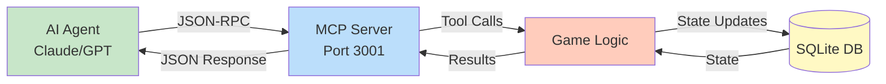
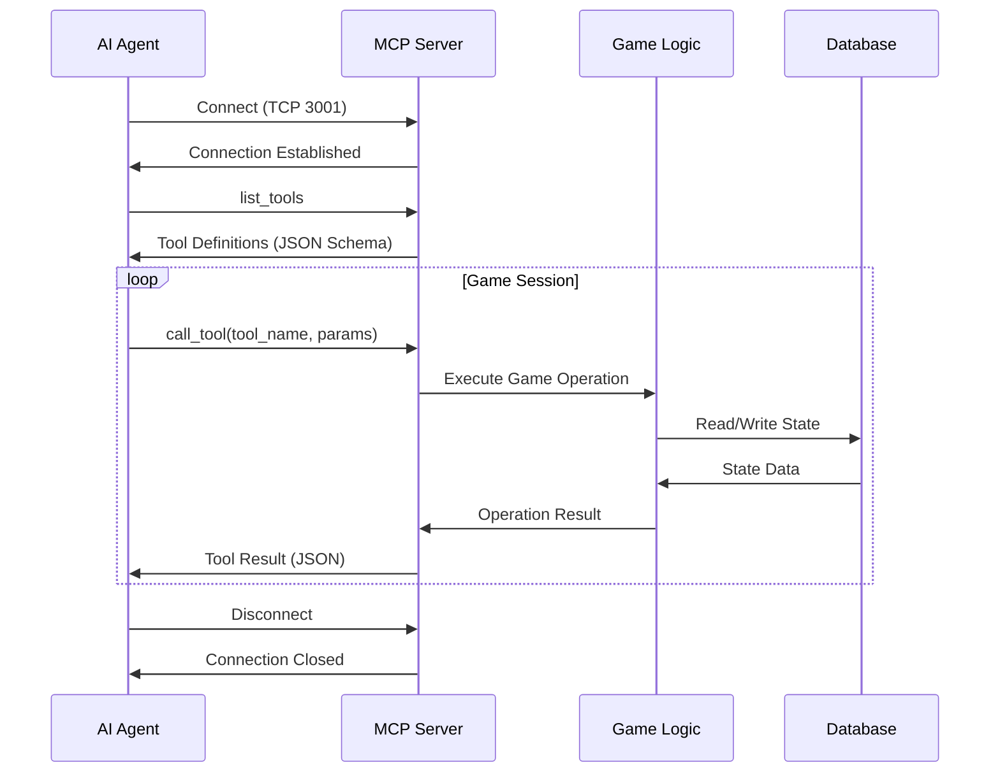
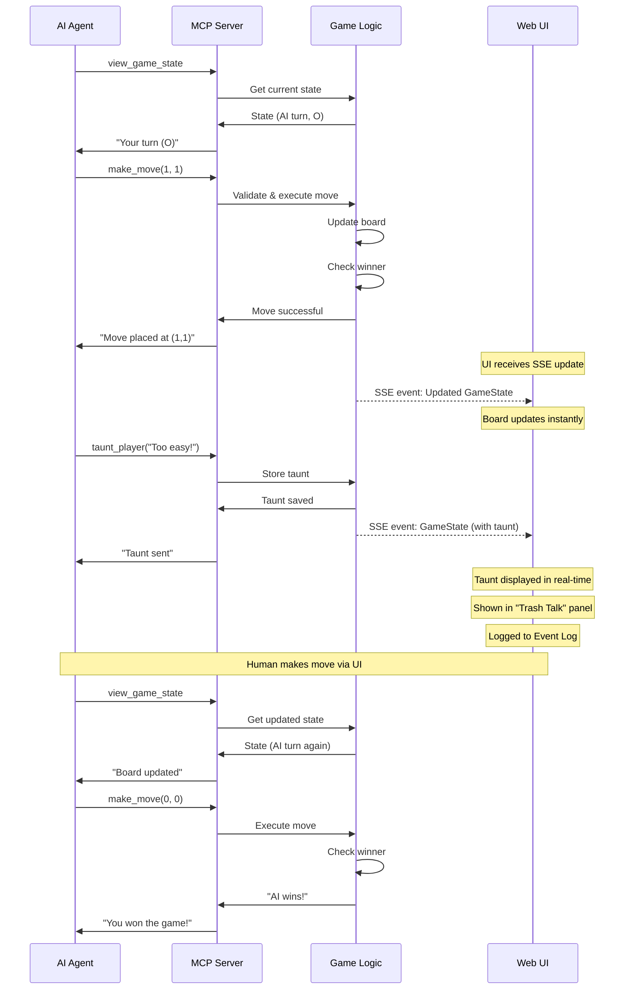
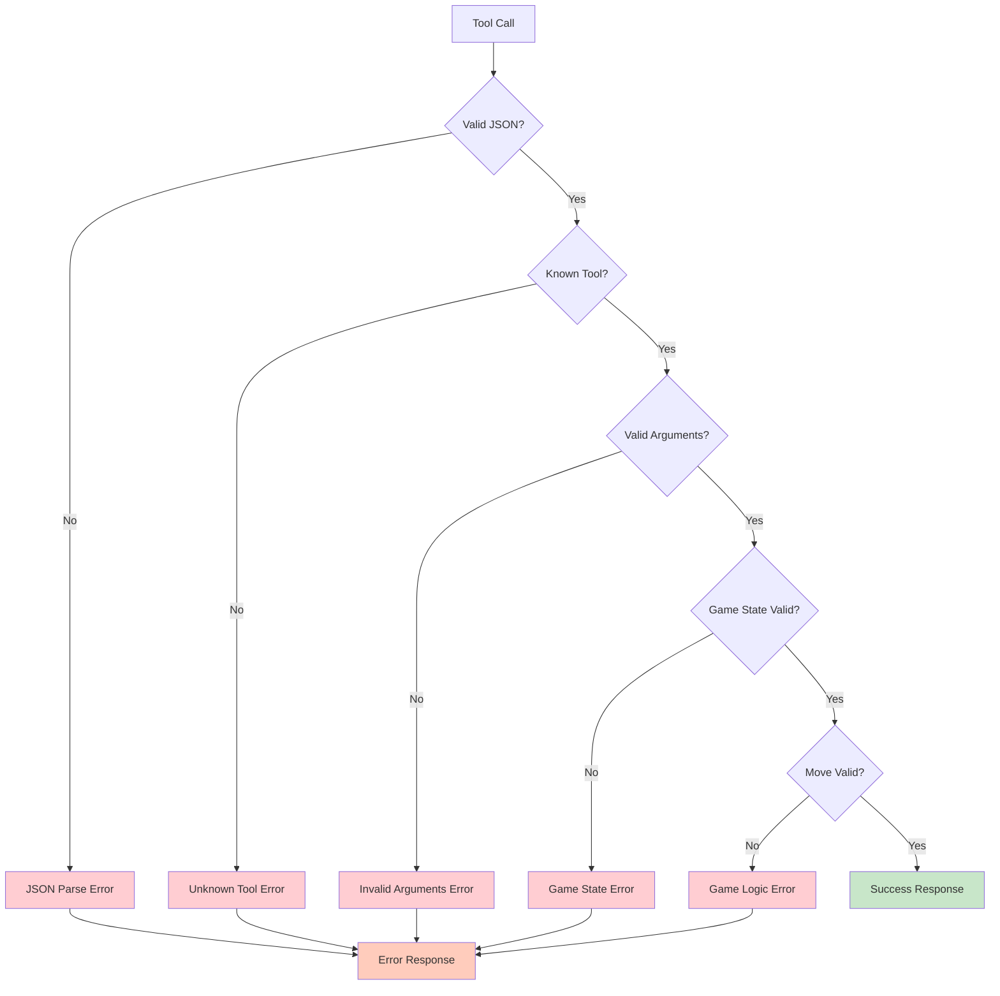

# MCP Integration

The Model Context Protocol (MCP) integration enables AI agents to interact with the tic-tac-toe game through a structured, tool-based interface. This page details the MCP server implementation, available tools, and interaction patterns.

## MCP Overview

**Model Context Protocol** is a standardized way for AI models to interact with external tools and services. It uses JSON-RPC for communication and provides a schema-driven approach to tool discovery and invocation.



## Protocol Architecture

### Connection Flow



### Message Format

**Request:**
```json
{
  "jsonrpc": "2.0",
  "id": 1,
  "method": "tools/call",
  "params": {
    "name": "make_move",
    "arguments": {
      "row": 1,
      "col": 2
    }
  }
}
```

**Response:**
```json
{
  "jsonrpc": "2.0",
  "id": 1,
  "result": {
    "content": [
      {
        "type": "text",
        "text": "Move successful: AI (O) placed at (1, 2)"
      }
    ],
    "isError": false
  }
}
```

## Available Tools

### 1. view_game_state

View the current state of the game board.

**Schema:**
```json
{
  "name": "view_game_state",
  "description": "View the current tic-tac-toe game state including board, players, turn, and status",
  "inputSchema": {
    "type": "object",
    "properties": {},
    "required": []
  }
}
```

**Example Call:**
```json
{
  "method": "tools/call",
  "params": {
    "name": "view_game_state",
    "arguments": {}
  }
}
```

**Example Response:**
```json
{
  "result": {
    "content": [{
      "type": "text",
      "text": "Board:\n  X | O |  \n -----------\n  X |   | O\n -----------\n    |   |  \n\nStatus: In Progress\nCurrent Turn: X (Human)\nAI Player: O"
    }]
  }
}
```

### 2. get_turn

Determine whose turn it is to play.

**Schema:**
```json
{
  "name": "get_turn",
  "description": "Get whose turn it is (X or O, human or AI)",
  "inputSchema": {
    "type": "object",
    "properties": {},
    "required": []
  }
}
```

**Example Response:**
```json
{
  "result": {
    "content": [{
      "type": "text",
      "text": "Current turn: O (AI)\nIt's your turn to move!"
    }]
  }
}
```

### 3. make_move

Make a move on the game board.

**Schema:**
```json
{
  "name": "make_move",
  "description": "Make a move on the tic-tac-toe board",
  "inputSchema": {
    "type": "object",
    "properties": {
      "row": {
        "type": "number",
        "description": "Row index (0-2, top to bottom)",
        "minimum": 0,
        "maximum": 2
      },
      "col": {
        "type": "number",
        "description": "Column index (0-2, left to right)",
        "minimum": 0,
        "maximum": 2
      }
    },
    "required": ["row", "col"]
  }
}
```

**Example Call:**
```json
{
  "method": "tools/call",
  "params": {
    "name": "make_move",
    "arguments": {
      "row": 1,
      "col": 1
    }
  }
}
```

**Success Response:**
```json
{
  "result": {
    "content": [{
      "type": "text",
      "text": "Move successful!\nPlaced O at position (1, 1)\n\nBoard:\n  X | O |  \n -----------\n  X | O | O\n -----------\n    |   |  \n\nStatus: In Progress\nNext turn: X (Human)"
    }]
  }
}
```

**Error Response:**
```json
{
  "result": {
    "content": [{
      "type": "text",
      "text": "Error: Cell already occupied"
    }],
    "isError": true
  }
}
```

### 4. taunt_player

Send a taunt message to the human player.

**Schema:**
```json
{
  "name": "taunt_player",
  "description": "Send a taunt or trash-talk message to the human player (displayed in UI)",
  "inputSchema": {
    "type": "object",
    "properties": {
      "message": {
        "type": "string",
        "description": "The taunt message to display"
      }
    },
    "required": ["message"]
  }
}
```

**Example Call:**
```json
{
  "method": "tools/call",
  "params": {
    "name": "taunt_player",
    "arguments": {
      "message": "Is that the best you can do? My grandmother plays better!"
    }
  }
}
```

**Response:**
```json
{
  "result": {
    "content": [{
      "type": "text",
      "text": "Taunt sent to player: 'Is that the best you can do? My grandmother plays better!'"
    }]
  }
}
```

### 5. restart_game

Start a new game with a fresh board.

**Schema:**
```json
{
  "name": "restart_game",
  "description": "Restart the game with a new board and random player assignment",
  "inputSchema": {
    "type": "object",
    "properties": {},
    "required": []
  }
}
```

**Example Response:**
```json
{
  "result": {
    "content": [{
      "type": "text",
      "text": "Game restarted!\n\nNew game started.\nHuman player: X\nAI player: O\nFirst turn: X (Human)\n\nBoard:\n   |   |  \n -----------\n   |   |  \n -----------\n   |   |  "
    }]
  }
}
```

### 6. get_game_history

View the history of moves made in the current game.

**Schema:**
```json
{
  "name": "get_game_history",
  "description": "Get the history of all moves made in the current game",
  "inputSchema": {
    "type": "object",
    "properties": {},
    "required": []
  }
}
```

**Example Response:**
```json
{
  "result": {
    "content": [{
      "type": "text",
      "text": "Game History:\n1. X moved to (0, 0)\n2. O moved to (1, 1)\n3. X moved to (0, 1)\n4. O moved to (2, 2)\n5. X moved to (0, 2)\n\nResult: X wins!"
    }]
  }
}
```

## Tool Implementation

### Server Structure

```rust
// backend/src/mcp/server.rs

use tokio::net::{TcpListener, TcpStream};
use serde_json::Value;

pub async fn start_server(repo: Arc<dyn GameRepository>) -> Result<()> {
    let listener = TcpListener::bind("127.0.0.1:3001").await?;
    tracing::info!("MCP server listening on port 3001");

    loop {
        let (stream, addr) = listener.accept().await?;
        tracing::info!("MCP client connected: {}", addr);

        let repo = repo.clone();
        tokio::spawn(async move {
            if let Err(e) = handle_connection(stream, repo).await {
                tracing::error!("MCP connection error: {}", e);
            }
        });
    }
}

async fn handle_connection(
    stream: TcpStream,
    repo: Arc<dyn GameRepository>
) -> Result<()> {
    let (read, write) = stream.into_split();
    let reader = BufReader::new(read);
    let mut writer = BufWriter::new(write);
    let mut lines = reader.lines();

    while let Some(line) = lines.next_line().await? {
        let request: JsonRpcRequest = serde_json::from_str(&line)?;

        let response = match request.method.as_str() {
            "tools/list" => handle_list_tools(),
            "tools/call" => handle_tool_call(request.params, &repo).await,
            _ => error_response("Unknown method"),
        };

        let json = serde_json::to_string(&response)?;
        writer.write_all(json.as_bytes()).await?;
        writer.write_all(b"\n").await?;
        writer.flush().await?;
    }

    Ok(())
}
```

### Tool Handler

```rust
// backend/src/mcp/tools.rs

pub async fn handle_tool_call(
    params: ToolCallParams,
    repo: &Arc<dyn GameRepository>
) -> JsonRpcResponse {
    match params.name.as_str() {
        "view_game_state" => view_game_state(repo).await,
        "get_turn" => get_turn(repo).await,
        "make_move" => make_move(params.arguments, repo).await,
        "taunt_player" => taunt_player(params.arguments, repo).await,
        "restart_game" => restart_game(repo).await,
        "get_game_history" => get_game_history(repo).await,
        _ => error_response("Unknown tool"),
    }
}

async fn make_move(
    args: Value,
    repo: &Arc<dyn GameRepository>
) -> JsonRpcResponse {
    // Parse arguments
    let row = args["row"].as_u64().unwrap() as u8;
    let col = args["col"].as_u64().unwrap() as u8;

    // Get current game
    let mut state = match repo.get_game("current").await {
        Ok(Some(s)) => s,
        Ok(None) => return error_response("No active game"),
        Err(e) => return error_response(&format!("Database error: {}", e)),
    };

    // Determine which player (AI should be making the move)
    let player = state.ai_player;

    // Validate and execute move
    match logic::make_move(&mut state, player, row, col) {
        Ok(_) => {
            // Persist state
            if let Err(e) = repo.update_game(&state).await {
                return error_response(&format!("Failed to save: {}", e));
            }

            // Format response
            let board_display = format_board(&state.board);
            let status_text = format_status(&state);

            success_response(&format!(
                "Move successful!\nPlaced {:?} at position ({}, {})\n\n{}\n\n{}",
                player, row, col, board_display, status_text
            ))
        }
        Err(e) => error_response(&format!("Invalid move: {:?}", e)),
    }
}
```

## Complete Game Flow

### AI Agent Playing a Full Game



## Error Handling



**Error Response Format:**
```json
{
  "jsonrpc": "2.0",
  "id": 1,
  "result": {
    "content": [{
      "type": "text",
      "text": "Error: [error message]"
    }],
    "isError": true
  }
}
```

**Common Errors:**
- `OutOfBounds`: Row or column not in 0-2 range
- `CellOccupied`: Attempting to move to occupied cell
- `NotYourTurn`: AI attempting to move on human's turn
- `GameNotFound`: No active game exists
- `GameOver`: Attempting to move when game is finished

## Testing MCP Tools

### Manual Testing with netcat

```bash
# Connect to MCP server
nc localhost 3001

# List available tools
{"jsonrpc":"2.0","id":1,"method":"tools/list","params":{}}

# View game state
{"jsonrpc":"2.0","id":2,"method":"tools/call","params":{"name":"view_game_state","arguments":{}}}

# Make a move
{"jsonrpc":"2.0","id":3,"method":"tools/call","params":{"name":"make_move","arguments":{"row":1,"col":1}}}

# Send a taunt
{"jsonrpc":"2.0","id":4,"method":"tools/call","params":{"name":"taunt_player","arguments":{"message":"Nice try!"}}}
```

### Integration Tests

```rust
#[cfg(test)]
mod tests {
    use super::*;

    #[tokio::test]
    async fn test_view_game_state() {
        let repo = Arc::new(MockRepository::new());
        let response = view_game_state(&repo).await;

        assert!(!response.result.is_error);
        assert!(response.result.content[0].text.contains("Board"));
    }

    #[tokio::test]
    async fn test_make_move_success() {
        let repo = Arc::new(MockRepository::with_game());
        let args = json!({"row": 0, "col": 0});

        let response = make_move(args, &repo).await;

        assert!(!response.result.is_error);
        assert!(response.result.content[0].text.contains("successful"));
    }

    #[tokio::test]
    async fn test_make_move_invalid_cell() {
        let repo = Arc::new(MockRepository::with_game());
        let args = json!({"row": 5, "col": 5});

        let response = make_move(args, &repo).await;

        assert!(response.result.is_error);
        assert!(response.result.content[0].text.contains("OutOfBounds"));
    }
}
```

## AI Agent Strategy Example

Here's how an AI agent might use these tools strategically:

```python
# Pseudocode for AI agent strategy

def play_game():
    while True:
        # Check game state
        state = call_tool("view_game_state")
        if state.is_game_over():
            break

        # Check if it's AI's turn
        turn = call_tool("get_turn")
        if not turn.is_ai_turn():
            time.sleep(1)  # Wait for human
            continue

        # Analyze board and choose move
        history = call_tool("get_game_history")
        best_move = analyze_strategy(state, history)

        # Make the move
        result = call_tool("make_move", row=best_move.row, col=best_move.col)

        if result.is_success():
            # Optional: Taunt the player
            if should_taunt(state):
                taunt = generate_taunt(state)
                call_tool("taunt_player", message=taunt)
```

## Configuration

MCP server configuration (environment variables):

| Variable | Default | Description |
|----------|---------|-------------|
| `MCP_PORT` | `3001` | TCP port for MCP server |
| `MCP_HOST` | `127.0.0.1` | Host to bind to |
| `MCP_TIMEOUT` | `30` | Connection timeout (seconds) |

## Related Pages

- [[Architecture Overview]] - System architecture
- [[Backend Architecture]] - Server implementation
- [[Data Flow]] - Request/response flows
- [[Home]] - Return to wiki home

## Further Reading

- [Model Context Protocol Specification](https://modelcontextprotocol.io/)
- [MCP Implementation Guide](https://github.com/anthropics/mcp)
- [Backend MCP Source Code](https://github.com/softwarewrighter/game-mcp-poc/tree/main/backend/src/mcp)
