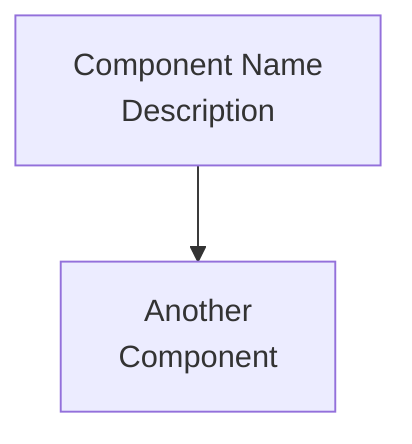

# Wiki Deployment Guide

This directory contains markdown files for the GitHub Wiki. These pages provide comprehensive architecture documentation with UML-like diagrams using Mermaid.

## Wiki Pages

- **Home.md** - Landing page with overview and navigation
- **Architecture-Overview.md** - System architecture and component diagrams
- **Backend-Architecture.md** - Server-side architecture details
- **Frontend-Architecture.md** - WASM/Yew implementation details
- **MCP-Integration.md** - Model Context Protocol integration
- **Data-Flow.md** - Sequence diagrams and data flows
- **_Sidebar.md** - Navigation sidebar (appears on all pages)

## Deploying to GitHub Wiki

GitHub Wiki is a separate git repository. Follow these steps to deploy:

### 1. Clone the Wiki Repository

```bash
# Clone the wiki repository (separate from main repo)
git clone https://github.com/sw-game-dev/game-mcp-poc.wiki.git

cd game-mcp-poc.wiki
```

### 2. Copy Wiki Files

```bash
# Copy all wiki markdown files
cp ../game-mcp-poc/wiki/*.md .

# Verify files
ls -la
# Should see: Home.md, Architecture-Overview.md, etc.
```

### 3. Commit and Push

```bash
# Add all wiki pages
git add *.md

# Commit
git commit -m "docs: Add comprehensive architecture documentation with Mermaid diagrams

- Add Home page with system overview
- Add Architecture Overview with component diagrams
- Add Backend Architecture with module details
- Add Frontend Architecture with WASM implementation
- Add MCP Integration with sequence diagrams
- Add Data Flow with interaction patterns
- Add navigation sidebar

All diagrams use Mermaid (no HTML break elements)
Links properly differentiate between wiki pages and repository docs"

# Push to wiki
git push origin master
```

### 4. Verify Deployment

Visit: https://github.com/sw-game-dev/game-mcp-poc/wiki

## Link Formats

The wiki uses specific link formats:

### Wiki Page to Wiki Page

```markdown
[[Page Name]]           # Links to Page-Name.md
[[Display|Page-Name]]   # Custom display text
```

### Wiki Page to Repository File

```markdown
[Link Text](https://github.com/sw-game-dev/game-mcp-poc/blob/main/path/to/file.md)
```

### Sidebar Links

Use the same format as wiki-to-wiki links:

```markdown
- [[Home]]
- [[Architecture Overview]]
```

## Mermaid Diagrams

All diagrams use Mermaid syntax. GitHub automatically renders them.

**Important:** Do NOT use HTML break elements (`<br>`) inside Mermaid diagrams. Use `<br/>` in labels only when necessary:



## Updating the Wiki

To update wiki content:

1. Edit markdown files in `wiki/` directory in main repo
2. Clone wiki repo (if not already cloned)
3. Copy updated files to wiki repo
4. Commit and push

## Maintenance

- Keep diagrams up-to-date with code changes
- Update links when repository structure changes
- Ensure all Mermaid diagrams render correctly on GitHub
- Verify cross-references between pages work

## Testing Locally

GitHub Wiki uses GitHub-flavored Markdown. To preview locally:

```bash
# Install grip (GitHub-flavored markdown previewer)
pip install grip

# Preview a file
grip Home.md
# Open http://localhost:6419 in browser
```

Note: Mermaid diagrams may not render in local preview but will work on GitHub.
